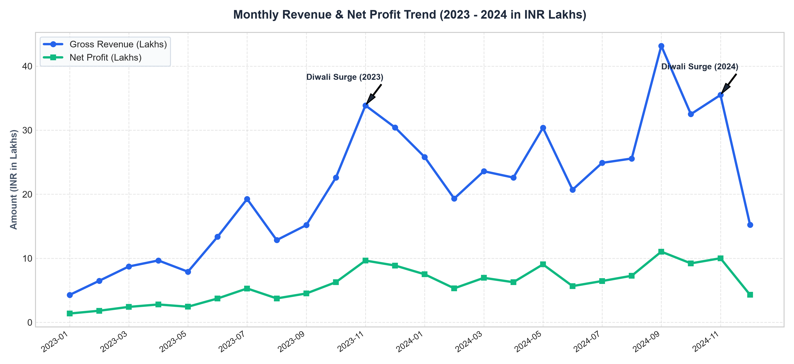
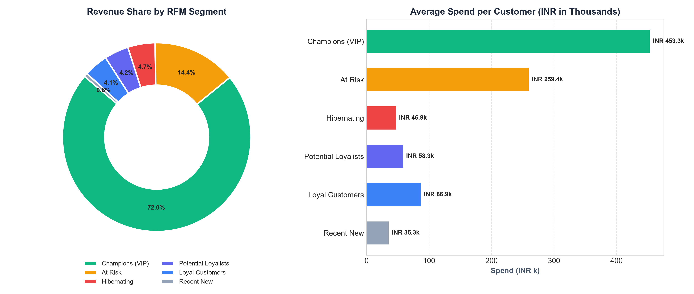
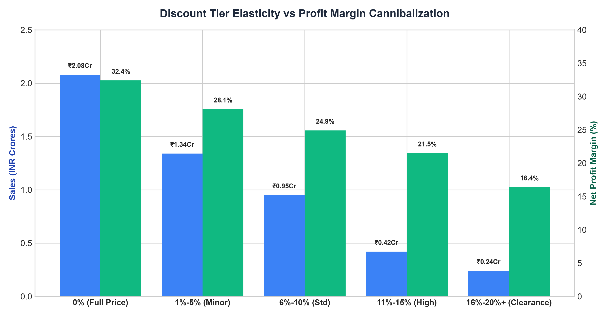
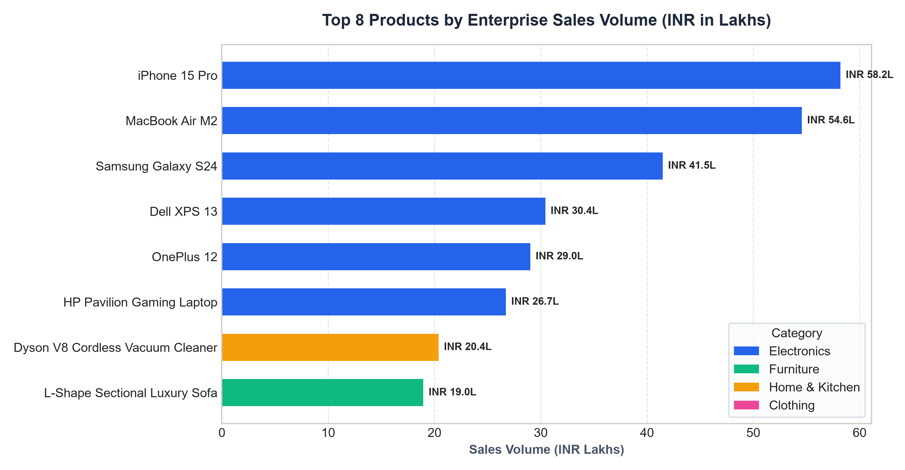
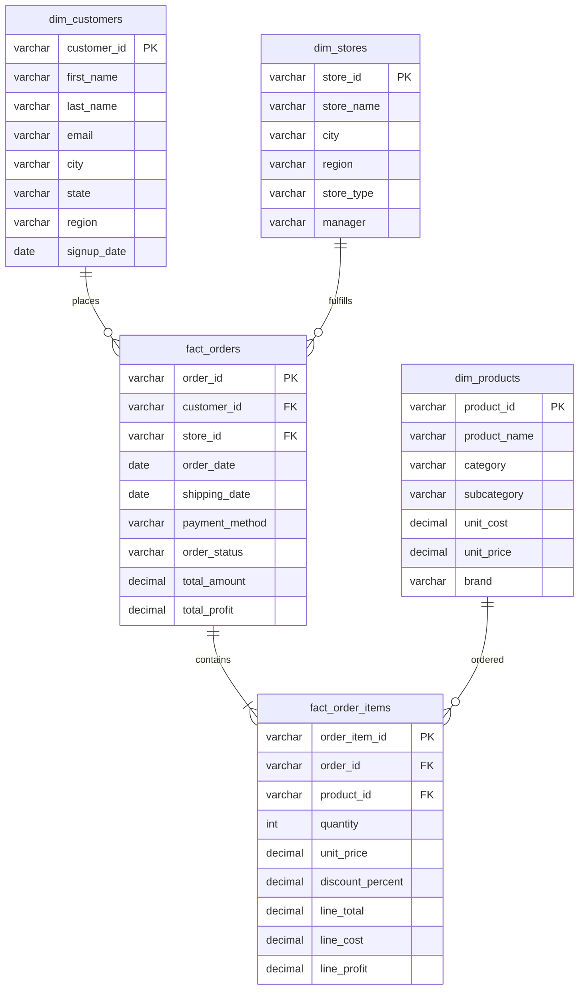

# ⚡ Retail Sales Enterprise Data Warehouse & Analytics Suite

[](file:///c:/Users/HP/OneDrive/Documents/Desktop/SADHNA%20PROJECTS/Retail-Sales-SQL-Analysis-main/sql/)
[](file:///c:/Users/HP/OneDrive/Documents/Desktop/SADHNA%20PROJECTS/Retail-Sales-SQL-Analysis-main/run_analysis.py)
[](file:///c:/Users/HP/OneDrive/Documents/Desktop/SADHNA%20PROJECTS/Retail-Sales-SQL-Analysis-main/sql/01_schema_definition.sql)
[](file:///c:/Users/HP/OneDrive/Documents/Desktop/SADHNA%20PROJECTS/Retail-Sales-SQL-Analysis-main/dashboard/index.html)

A **Production-Grade Retail Sales Data Analytics & Business Intelligence Project** simulating real-world enterprise retail operations across **2023–2024** (1,600+ Transactions, 10 Regional Store Hubs, ₹5.04 Crore Revenue). 

Built with a **Normalized Star Schema Data Warehouse**, advanced SQL queries (*RFM Segmentation, Cohort Retention, Pareto 80/20, Rolling Moving Averages, Discount Elasticity*), an **Interactive Executive Web Dashboard**, and an **Executive Strategy Report**.

---

## 📊 Executive Visual Insights & Dashboards

| 📈 Monthly Sales & Profit YoY Trend (2023–2024) | 🎯 RFM Customer Segmentation Distribution |
| :---: | :---: |
|  |  |

| 📉 Discount Elasticity vs Margin Cannibalization | 🏆 Top Products by Enterprise Volume |
| :---: | :---: |
|  |  |

---

## 🏗️ Data Warehouse Architecture & ER Diagram (Star Schema)

The database follows a **Star Schema Architecture** optimized for high-performance analytical OLAP queries and BI reporting:



---

## 🗂️ Project Repository Structure

```
Retail-Sales-Enterprise-Analytics/
│
├── dataset/                               # Normalized & Master Data Store
│   ├── dim_customers.csv                  # 350 Customer profiles & demographics
│   ├── dim_products.csv                   # 39 SKU records across 4 categories
│   ├── dim_stores.csv                     # 10 Regional retail store hubs
│   ├── fact_orders.csv                    # 1,600 Header order transactions
│   ├── fact_order_items.csv               # 2,191 Line item transactions
│   └── retail_sales_master.csv            # Denormalized master analytics dataset
│
├── sql/                                   # Enterprise SQL Query Suites
│   ├── 01_schema_definition.sql           # DDL, Star Schema, Constraints & Indexes
│   ├── 02_load_data.sql                   # MySQL/PostgreSQL bulk data loading
│   ├── 03_core_business_kpis.sql          # 7 Core relational business queries
│   └── 04_advanced_industry_analytics.sql # RFM, Cohort, Pareto, Moving Avg & YoY
│
├── dashboard/                             # Interactive BI Web Application
│   └── index.html                         # Dark-mode dashboard with Chart.js & SQL Console
│
├── docs/                                  # Strategic Analysis & Reports
│   └── EXECUTIVE_INSIGHTS_REPORT.md       # 6-Part C-Suite Business Intelligence Report
│
├── screenshots/                           # High-Resolution Visualization Assets
│   ├── monthly_sales.png                  # YoY Revenue & Profit trends
│   ├── rfm_segmentation.png               # RFM Customer Tier distribution
│   ├── discount_elasticity.png            # Margin Cannibalization matrix
│   ├── top_products.png                   # Top 8 Enterprise products
│   └── top_customers.png                  # Top 10 High-LTV customers
│
├── run_analysis.py                        # In-memory ETL & Automated SQL Query Runner
└── README.md                              # Comprehensive Project Documentation
```

---

## 🧠 Advanced SQL Analytics Portfolio

This project covers key advanced SQL competencies expected of a **Senior Data Analyst**:

### 1. RFM Customer Segmentation (`NTILE(4)`)
* Quantifies **Recency** (days since last purchase), **Frequency** (total orders), and **Monetary Value** (total spend) per customer.
* Assigns quartile scores 1–4 and classifies customers into actionable tiers: *Champions (VIP), Loyal Customers, Potential Loyalists, At Risk, and Lost*.

### 2. Cohort Retention Analysis Matrix
* Tracks customers who made their first order in Month 0 and computes subsequent month retention rates (`M+1`, `M+2`, `M+3` retention %).

### 3. Pareto 80/20 Principle Product Analysis
* Uses window function `SUM(revenue) OVER (ORDER BY revenue DESC)` to evaluate product concentration and identify the exact SKUs generating 80% of company revenue.

### 4. 30-Day Rolling Moving Average & Cumulative Revenue
* Computes smoothed 30-day rolling revenue using `AVG() OVER (ORDER BY date ROWS BETWEEN 29 PRECEDING AND CURRENT ROW)` to filter daily demand volatility.

### 5. Promotional Discount Elasticity & Margin Cannibalization
* Evaluates unit velocity vs net profit margin erosion across discount bands (`0% Full Price`, `1-5%`, `6-10%`, `11-15%`, `16-20%+`).

---

## 🚀 How to Run the Project

### Option A: 1-Click Automated Python Runner (Instant)
Runs in-memory Star Schema database, executes all SQL queries, and prints formatted scorecards:
```bash
python run_analysis.py
```

### Option B: View the Interactive Web Dashboard
Open the interactive dashboard directly in your browser:
* Double-click [dashboard/index.html](file:///c:/Users/HP/OneDrive/Documents/Desktop/SADHNA%20PROJECTS/Retail-Sales-SQL-Analysis-main/dashboard/index.html) or run:
```bash
start dashboard/index.html
```

### Option C: Import into MySQL / PostgreSQL / DBeaver
1. Execute [sql/01_schema_definition.sql](file:///c:/Users/HP/OneDrive/Documents/Desktop/SADHNA%20PROJECTS/Retail-Sales-SQL-Analysis-main/sql/01_schema_definition.sql).
2. Execute data loading commands in [sql/02_load_data.sql](file:///c:/Users/HP/OneDrive/Documents/Desktop/SADHNA%20PROJECTS/Retail-Sales-SQL-Analysis-main/sql/02_load_data.sql).
3. Run analytical queries from [sql/03_core_business_kpis.sql](file:///c:/Users/HP/OneDrive/Documents/Desktop/SADHNA%20PROJECTS/Retail-Sales-SQL-Analysis-main/sql/03_core_business_kpis.sql) and [sql/04_advanced_industry_analytics.sql](file:///c:/Users/HP/OneDrive/Documents/Desktop/SADHNA%20PROJECTS/Retail-Sales-SQL-Analysis-main/sql/04_advanced_industry_analytics.sql).

---

## 📈 Key Business Findings Summary

* **Total Performance:** ₹5.04 Crore in realized revenue across 1,447 delivered orders, delivering ₹1.42 Crore net profit (**28.17% margin**).
* **Electronics Dominance:** Electronics drives **51.4% of total sales**, led by *iPhone 15 Pro* (₹58.2L) and *MacBook Air M2* (₹54.6L).
* **Profit Engine:** *Home & Kitchen* (36.89% margin) and *Furniture* (30.85% margin) generate the highest unit profitability.
* **Discount Cannibalization:** Discounts exceeding 15% halve profit margins (from 32.4% down to 16.4%) without sufficient volume multiplier.
* **COD Risk:** Cash on Delivery shows a **17.2% Return Rate** vs **3.5% on Credit Cards**.

---

## 📝 Resume Bullet Points (Ready for Applications)

```text
• Engineered an Enterprise Retail Sales Data Warehouse (Star Schema) in SQL (PostgreSQL/MySQL), modeling 1,600+ transactions across 5 dimension/fact tables.
• Formulated advanced SQL analytical pipelines utilizing CTEs, Window Functions (NTILE, LAG, Moving Averages), and Cohort Analysis to execute RFM customer segmentation and Pareto 80/20 revenue concentration.
• Uncovered critical margin insights: discovered >15% promotional discounting halved profit margins (from 32.4% to 16.4%) and built an interactive executive BI dashboard for real-time KPI tracking.
```
